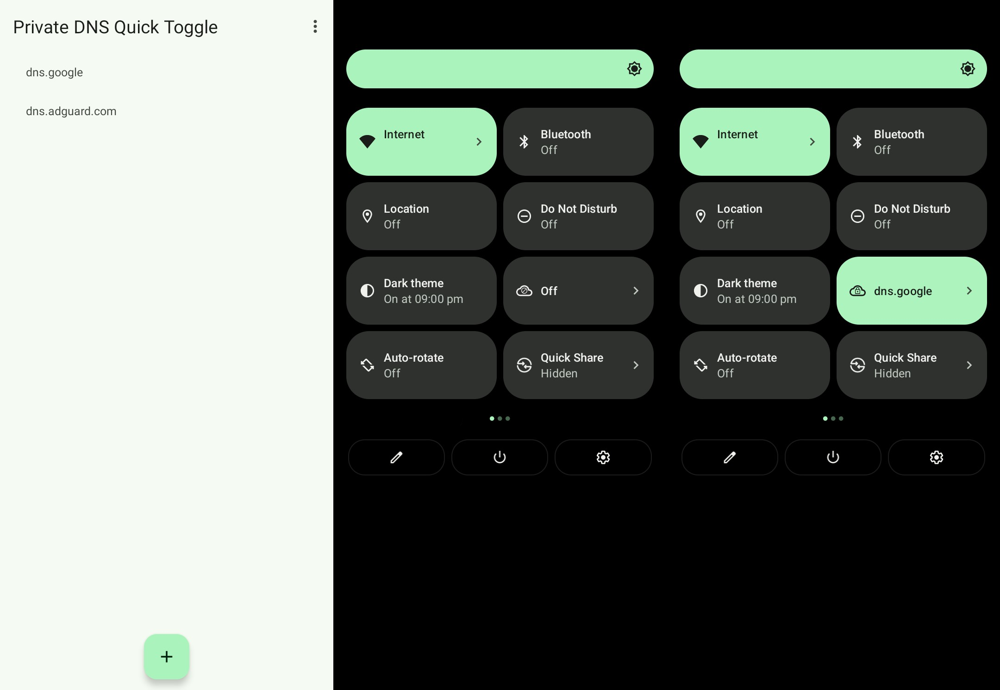

[](https://github.com/karasevm/PrivateDNSAndroid/releases/latest)
[](https://github.com/karasevm/PrivateDNSAndroid/releases/latest)
[](https://apt.izzysoft.de/fdroid/index/apk/ru.karasevm.privatednstoggle)
[](https://hosted.weblate.org/engage/privatednsandroid/)

# Private DNS Quick Toggle
A quick settings tile to switch your private dns provider. Supports any number of providers. Makes it easy to turn adblocking dns servers on or off with just
a single tap.



## Installation
Get the latest apk on the [releases page](https://github.com/karasevm/PrivateDNSAndroid/releases/latest) 
or from [IzzyOnDroid repo](https://apt.izzysoft.de/fdroid/index/apk/ru.karasevm.privatednstoggle).

### Automatic (Shizuku)
1. Install and start [Shizuku](https://shizuku.rikka.app/).
2. Start the app and allow Shizuku access when prompted.

### Manual
For the app to work properly you'll need to provide it permissions via ADB:

1. Get to your PC and download platform tools from google [here](https://developer.android.com/studio/releases/platform-tools).
2. Extract the tools, and open terminal in the same directory ([Windows guide](https://youtu.be/6vVFmOcIADg?t=38), [macos guide](https://www.howtogeek.com/210147/how-to-open-terminal-in-the-current-os-x-finder-location/)).
3. Turn on USB Debugging on your phone (This may require different steps, for Xiaomi you also have to enable `USB Debugging (Security settings)`, but generally [this video guide](https://youtu.be/Ucs34BkfPB0?t=29) should work on most phones)
4. Connect your phone to your PC
5. Run this command in the terminal

```
./adb shell pm grant ru.karasevm.privatednstoggle android.permission.WRITE_SECURE_SETTINGS
```

6. That's it, you should have the app installed.

## Contributing

### Translation
The easiest way to contribute would be to submit a translation to your language. Thanks to Weblate gratis hosting for open-source projects you can do it without any programming knowledge on [their website](https://hosted.weblate.org/engage/privatednsandroid/).
#### Translation status
<a href="https://hosted.weblate.org/engage/privatednsandroid/">

</a>

### Code
If you want to contribute code please try to adhere to the following guidelines:
- Include javadoc comments for all the public methods you add
- Keep the code neatly formatted, you can you the built-in Android Studio formatter
- Please describe what your code does and how does it do that when sending a PR
- Before sending a PR please test your change on the oldest and latest supported Android versions (9 and 14 at the time of writing)
